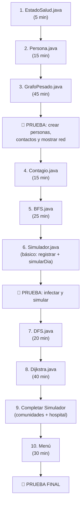

# Simulador de Propagación de Epidemias — Plan Manual Paso a Paso

## Estado Actual del Proyecto

Ya tienes:
- ✅ Proyecto NetBeans creado con estructura MVC (`Models/`, `Views/`, `Controllers/`)
- ✅ [Grafo.java](file:///c:/Users/User/Documents/NetBeansProjects/SImulacionDePropagacionDeVirus/src/Models/Grafo.java) — grafo genérico no dirigido con lista de adyacencias
- ✅ [PantallaPrincipal.java](file:///c:/Users/User/Documents/NetBeansProjects/SImulacionDePropagacionDeVirus/src/Views/PantallaPrincipal.java) — JFrame vacío

Te falta construir **todo lo demás**. El plan asume que vas a hacerlo tú a mano.

---

## Archivos a Crear (Orden de Creación)

| # | Archivo | Paquete | Descripción |
|---|---------|---------|-------------|
| 1 | `EstadoSalud.java` | `Models` | Enum con los 3 estados |
| 2 | `Persona.java` | `Models` | Vértice del grafo |
| 3 | `GrafoPesado.java` | `Models` | Extiende tu Grafo con pesos |
| 4 | `BFS.java` | `Models` | Recorrido por amplitud |
| 5 | `DFS.java` | `Models` | Recorrido por profundidad |
| 6 | `Dijkstra.java` | `Models` | Camino más corto |
| 7 | `Contagio.java` | `Models` | Lógica de probabilidad |
| 8 | `Simulador.java` | `Controllers` | Orquesta toda la simulación |
| 9 | Modificar `PantallaPrincipal.java` | `Views` | Menú y UI |

---

## FASE 1 — `EstadoSalud.java` (5 minutos)

Crea un enum en `src/Models/`:

```java
package Models;

public enum EstadoSalud {
    SANO,
    INFECTADO,
    RECUPERADO
}
```

**Nada más.** Solo 3 constantes.

---

## FASE 2 — `Persona.java` (15 minutos)

Crea la clase en `src/Models/`. Esta clase **debe implementar `Comparable<Persona>`** porque tu `Grafo` lo requiere (`T extends Comparable<T>`).

### Atributos
```java
private String nombre;
private EstadoSalud estado;
private int diasInfectado;
private int edad;
```

### Lo que necesitas implementar

1. **Constructor**: recibe `nombre` y `edad`. El estado inicial es `SANO`, días infectado = 0.
2. **Getters y Setters** para todos los atributos.
3. **`compareTo(Persona otra)`**: compara por `nombre` (usa `this.nombre.compareTo(otra.nombre)`). Esto es **obligatorio** para que funcione con tu Grafo.
4. **`toString()`**: devuelve algo como `"Juan [SANO]"` o `"Pedro [INFECTADO - Día 3]"`.
5. **`equals()` y `hashCode()`**: basados en `nombre` (dos personas con el mismo nombre son iguales).

> [!IMPORTANT]
> Si no implementas `compareTo`, tu `Grafo` no aceptará objetos `Persona`. Es el error más común.

---

## FASE 3 — `GrafoPesado.java` (30-45 minutos)

Esta es la parte más importante. Necesitas un grafo que almacene **pesos** (horas de contacto) en las aristas.

### Opción recomendada: Hereda de tu `Grafo`

Crea `src/Models/GrafoPesado.java`:

```java
package Models;

public class GrafoPesado<T extends Comparable<T>> extends Grafo<T> {
    // ...
}
```

### Estructura para almacenar pesos

Tu `Grafo` base usa `List<List<Integer>>` para las adyacencias. Para los pesos necesitas una estructura paralela. Opciones:

**Opción A — Matriz de pesos (más fácil para Dijkstra/Floyd):**
```java
private double[][] matrizDePesos;
private static final double INFINITO = Double.MAX_VALUE;
```
Cada vez que insertas un vértice, debes redimensionar la matriz.

**Opción B — Map de pesos (más simple):**
```java
private Map<String, Double> pesos; // clave: "indiceOrigen-indiceDestino"
```

### Métodos que debes implementar

| Método | Qué hace |
|--------|----------|
| `insertarAristaPesada(T origen, T destino, double peso)` | Llama a `super.insertarArista(origen, destino)` y guarda el peso |
| `getPeso(T origen, T destino)` | Devuelve el peso de la arista |
| `toString()` | Muestra la red: `Juan → Pedro (7h), Ana (4h)` |

### Cómo implementar `insertarAristaPesada`

```java
public void insertarAristaPesada(T origen, T destino, double peso) {
    // 1. Insertar la arista usando el método del padre
    super.insertarArista(origen, destino);
    
    // 2. Guardar el peso (en ambas direcciones, es no dirigido)
    int nroOrigen = getNumeroDeVertice(origen);
    int nroDestino = getNumeroDeVertice(destino);
    // Guarda el peso en tu estructura elegida
}
```

> [!WARNING]
> **Redimensionar la matriz**: cada vez que llamas a `insertarVertice()`, la matriz debe crecer. Sobreescribe `insertarVertice()` para que haga `super.insertarVertice(unVertice)` y luego redimensione la matriz.

---

## FASE 4 — `BFS.java` (20-30 minutos)

Recorrido por amplitud. Este es el **corazón del contagio**: cada día simulas "un nivel" de BFS.

### Estructura
```java
package Models;

import java.util.*;

public class BFS<T extends Comparable<T>> {
    private Grafo<T> grafo;
    private boolean[] marcados;
    
    public BFS(Grafo<T> grafo) { ... }
    
    // Recorrido BFS completo desde un vértice
    public List<T> recorrer(T origen) { ... }
}
```

### Algoritmo BFS clásico
1. Crear una `Queue<T>` (usa `LinkedList`)
2. Marcar el origen como visitado
3. Encolar el origen
4. Mientras la cola no esté vacía:
   - Desencolar un vértice
   - Para cada adyacente no visitado:
     - Marcarlo
     - Encolarlo
     - Agregarlo al resultado

---

## FASE 5 — `DFS.java` (20 minutos)

Recorrido por profundidad. Lo usarás para **encontrar comunidades** (componentes conexas).

### Estructura
```java
package Models;

import java.util.*;

public class DFS<T extends Comparable<T>> {
    private Grafo<T> grafo;
    private boolean[] marcados;
    
    public DFS(Grafo<T> grafo) { ... }
    
    // Encuentra todos los vértices alcanzables desde origen
    public List<T> recorrer(T origen) { ... }
    
    // Encuentra todas las componentes conexas (comunidades)
    public List<List<T>> encontrarComunidades() { ... }
}
```

### Para encontrar comunidades
1. Crear un arreglo `marcados` de tamaño = cantidad de vértices
2. Para cada vértice no marcado:
   - Hacer DFS desde ese vértice
   - Todos los vértices visitados en ese DFS forman UNA comunidad
   - Agregar esa lista a la lista de comunidades

---

## FASE 6 — `Dijkstra.java` (30-40 minutos)

Camino más corto desde un vértice a todos los demás. Lo usarás para la **ruta al hospital**.

### Estructura
```java
package Models;

import java.util.*;

public class Dijkstra<T extends Comparable<T>> {
    private GrafoPesado<T> grafo;
    private double[] distancias;
    private int[] predecesores;
    
    public Dijkstra(GrafoPesado<T> grafo) { ... }
    
    public void ejecutar(T origen) { ... }
    
    public double getDistancia(T destino) { ... }
    
    public List<T> getCamino(T destino) { ... }
}
```

### Algoritmo Dijkstra
1. Inicializar `distancias[]` con INFINITO, excepto el origen = 0
2. Inicializar `predecesores[]` con -1
3. Crear conjunto de no visitados
4. Repetir mientras haya no visitados:
   - Seleccionar el no visitado con menor distancia
   - Para cada adyacente:
     - Si `distancias[actual] + peso(actual, adyacente) < distancias[adyacente]`:
       - Actualizar `distancias[adyacente]`
       - Actualizar `predecesores[adyacente]`
5. Para reconstruir el camino: seguir `predecesores[]` desde destino hasta origen

---

## FASE 7 — `Contagio.java` (15 minutos)

La lógica de probabilidad de contagio.

```java
package Models;

import java.util.Random;

public class Contagio {
    private static final Random random = new Random();
    
    // Tabla de probabilidades según horas de contacto
    public static int getProbabilidad(double horasDeContacto) {
        if (horasDeContacto >= 8) return 100;
        if (horasDeContacto >= 7) return 90;
        if (horasDeContacto >= 6) return 80;
        if (horasDeContacto >= 5) return 65;
        if (horasDeContacto >= 4) return 50;
        if (horasDeContacto >= 3) return 35;
        if (horasDeContacto >= 2) return 20;
        return 10;
    }
    
    // Determina si ocurre contagio
    public static boolean seContagia(double horasDeContacto) {
        int probabilidad = getProbabilidad(horasDeContacto);
        int tirada = random.nextInt(100); // 0-99
        return tirada < probabilidad;
    }
}
```

---

## FASE 8 — `Simulador.java` (45-60 minutos) ⭐ LA MÁS COMPLEJA

Este es el controlador principal. Va en `src/Controllers/`.

### Atributos
```java
package Controllers;

import Models.*;
import java.util.*;

public class Simulador {
    private GrafoPesado<Persona> red;
    private int diaActual;
    private static final int DIAS_PARA_RECUPERARSE = 7;
}
```

### Métodos a implementar (en orden)

#### 1. `registrarPersona(String nombre, int edad)`
- Crear un objeto `Persona`
- Llamar a `red.insertarVertice(persona)`

#### 2. `registrarContacto(String nombre1, String nombre2, double horas)`
- Buscar ambas personas en el grafo
- Llamar a `red.insertarAristaPesada(persona1, persona2, horas)`

#### 3. `infectarPacienteCero(String nombre)`
- Buscar la persona
- Cambiar su estado a `INFECTADO`

#### 4. `simularDia()` — **EL MÉTODO MÁS IMPORTANTE**
```
Para cada persona en el grafo:
    Si está INFECTADA:
        Incrementar sus diasInfectado
        Si diasInfectado >= 7:
            Cambiar estado a RECUPERADO
            Continuar al siguiente
        
        Para cada adyacente (vecino) de esta persona:
            Si el vecino está SANO:
                Obtener el peso (horas) de la arista
                Si Contagio.seContagia(horas):
                    Cambiar estado del vecino a INFECTADO
    
    diaActual++
```

> [!CAUTION]
> **Error común**: No modifiques los estados de las personas mientras las recorres. Primero **recolecta** quiénes se deben contagiar en una lista temporal, y luego **aplica** los cambios. Si no, una persona recién infectada podría contagiar a otros en el mismo día.

#### 5. `mostrarRed()`
- Imprimir el grafo con `toString()`

#### 6. `mostrarInfectados()`
- Recorrer todos los vértices y mostrar los que tengan estado `INFECTADO`

#### 7. `estadisticas()`
- Contar: total de personas, infectados, recuperados, sanos
- Mostrar porcentajes

#### 8. `mostrarComunidades()`
- Crear un objeto `DFS` con el grafo
- Llamar a `encontrarComunidades()`
- Mostrar cada grupo

#### 9. `buscarRutaAlHospital(String nombrePaciente)`
- El "hospital" es un vértice especial que debes agregar al grafo
- Crear un objeto `Dijkstra` con el grafo
- Ejecutar desde el hospital
- Mostrar el camino y la distancia

---

## FASE 9 — Menú en `PantallaPrincipal.java` (30 minutos)

Tienes dos opciones:

### Opción A: Consola (más simple, lo que sugiere el plan)
Ignora el JFrame y crea un `main` con `Scanner`:

```java
Scanner sc = new Scanner(System.in);
Simulador sim = new Simulador();

while (true) {
    System.out.println("=============================");
    System.out.println("  SIMULADOR DE EPIDEMIA");
    System.out.println("=============================");
    System.out.println("1. Registrar persona");
    System.out.println("2. Registrar contacto");
    // ... opciones 3-11
    int opcion = sc.nextInt();
    
    switch (opcion) {
        case 1: // registrar persona
        case 2: // registrar contacto
        // ...
    }
}
```

### Opción B: JFrame (más impresionante)
Usa tu `PantallaPrincipal` y agrega botones con el editor de NetBeans. Cada botón llama a un método del `Simulador`.

---

## Orden Recomendado de Implementación



---

## Open Questions

> [!IMPORTANT]
> **¿Consola o JFrame?** Tu plan original dice "Consola (la primera versión)" pero ya tienes un JFrame creado. ¿Quieres el menú por consola o quieres usar la interfaz gráfica?

> [!IMPORTANT]
> **¿Ya tienes más clases de grafos?** El plan menciona que copies BFS, DFS, Dijkstra, Floyd, etc. ¿Tienes esas clases ya hechas en otro proyecto, o las vas a escribir desde cero?

> [!IMPORTANT]
> **¿Floyd es necesario?** El plan lo menciona (Fase 18), pero con Dijkstra ya puedes resolver la ruta al hospital. ¿Quieres incluir Floyd o lo omitimos para simplificar?

---

## Verificación

Después de cada fase, prueba lo siguiente:

| Fase | Prueba |
|------|--------|
| 1-2 | Crear varias `Persona`, imprimirlas, verificar `compareTo` |
| 3 | Crear un `GrafoPesado<Persona>`, insertar aristas con peso, imprimir |
| 4-6 | Ejecutar BFS/DFS/Dijkstra en un grafo pequeño de prueba |
| 7 | Llamar a `Contagio.seContagia(6)` muchas veces y verificar que ~80% dan true |
| 8 | Crear 5 personas, conectarlas, infectar una, simular 3 días y ver la propagación |
| 9 | Verificar que todo el menú funcione de inicio a fin |

**Tiempo total estimado: 4-6 horas de trabajo.**
